# Chess Position Ranking

| This is what       | random legal       | chess positions    | look like          |
| ------------------ | ------------------ | ------------------ | ------------------ |
| 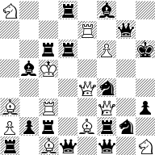 |  | 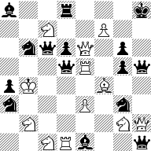 | 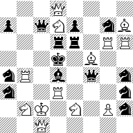 |
|  |  |  |  |
|  |  |  | 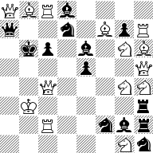 |
|  | 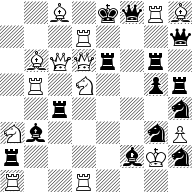 |  | 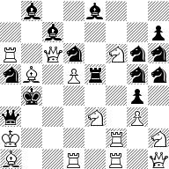 |
|  | 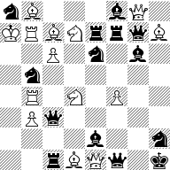 | 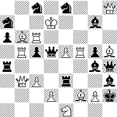 |  |
|  | 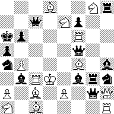 |  | 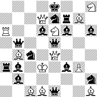 |
| 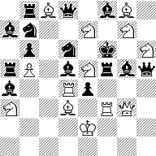 |  |  |  |
|  |  |  | 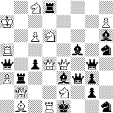 |
|  |  |  |  |

This Haskell based software suite was written to accurately estimate the number of legal chess positions, already pondered by Claude Shannon in 1950 [1]. A position is legal iff it's reachable from the starting position in a valid game of chess.

For definiteness, let us clarify exactly what is meant by a position. It includes the placement of all pieces on the board (which shall be called a Diagram), the side to move, the castling possibilities (reflecting which rooks or kings have moved), and whether a pawn can be captured en-passant.
The correspond to the first four fields in the so-called Forsyth–Edwards Notation or FEN [2], with the exception that we shall consider a position to feature en-passant only when the pawn that just moved 2 spaces finds itself adjacent to an opponent pawn.

The reason for satisfying ourselves with a mere estimate is that we have no hope of ever determining the number exactly, like we did in the game of Go [3]. Whereas in Go, deciding whether a given position is legal is quite simple, determining the legality of a given chess position is exceedingly hard. It is the essence of so-called retrograde analysis problems [4] that concern the possible past moves rather than the possible future moves that normal chess problems concern themselves with.

The reader is invited to study some of the best retrograde problems ever composed, together with their intricate solution, at this ``Masterworks'' collection [5]. Evidence of the algorithmic hardness of retrograde problems may be found in this recent computational complexity paper [6] that proves retrograde decision problems on arbitrarily large chess boards to be PSPACE-hard.

# Previous Work

In his 1994 PhD thesis [7], Victor Allis wrote
``In our calculation of the state-space complexity of chess, we have included
all states obtained through various minor promotions. Using rules to
determine the number of possible promotions, given the number of pieces
and pawns captured by either side, an upper bound of 5E52 was calculated.
Not all of these positions will be legal, due to the king of the player who just
moved being in check, or due to the position being unreachable through a
series of legal moves. Therefore, we assume the true state-space complexity
to be close to 1E50''

While these numbers turn out to be many orders of magnitude too large (perhaps due to a programming bug), we will likewise be estimating the fraction of legal positions within a larger set that does admit counting.

In 1996, Shirish Chinchalkar obtained an upper bound of 1.77894E46 [8].
A copy of the program that Shirish Chinchalkar developed to compute his upperbound may be found
in Will Entriken github's repo [9], which mainly contains his software for ranking chess diagrams.

# New results

We improve the upper bound to N = 8726713169886222032347729969256422370854716254, or ~ 8.7E45. This result is computed in under 10s by src/CountChess.hs (Makefile target count).

More importantly, we can efficiently map any legal chess position into an integer in the range 0..N-1 (to rank a position), and map any integer in that range to a chess position (to unrank an integer).
It's possible for different integers to map to the same position, which prevents the rank and unrank functions from being inverses of each other.

We restore this desirable property by instead mapping integers to so called `uniquely rankable positions', urpositions for short. These annote a position with 2 extra numbers. One being the number n of ranks that map to the position (its multiplicity), and the other being a number in the range 0..n-1.

Conveniently, we can (ab)use the final two fields of the Forsyth–Edwards Notation for this annotation.
Thus we obtain a 1-1 correspondence between integers 0..N-1 and urpositions representable as FENs.

We produced a set of 1000 random integers in the range 0..N-1 using Haskell's built-in random number generator, using a seed of 0 for reproducibility, and sorted the result (Makefile target testRnd1kRanks).
We then unranked these to obtain 1000 random urpositions (Makefile target testRnd1kFENs), and ran some simple legality tests that found 907 of the positions to be definitely illegal (Makefile target testRnd1kResearch).

Manual analysis of the remaining 93 positions found 52 (5.2% of the sample) to be legal.
The file sortedRnd1kResearchManual contains all 1000 positions together with their legality determination. The 52 legal positions have an average multiplicity of 56/52~1.077, slightly higher than the 1.052 average of all 1000.

With a 95% confidence level [10], this yields an **estimated number of legal positions of** (5.2% +- 1.96 sqrt(5.2% * 94.8% / 1000)) * N / 1.077, or **4.2e44 +- 1.1e44**.
Note that this is still less than one digit of accuracy.

# Future Work

More accuracy can be obtained by analysing the larger samples testRnd10kResearch, testRnd100kResearch, or testRnd1mResearch, with the last one giving a full 2 digits of accuracy at the 95% confidence level.
While manual analysis of the 921 potentially legal positions in the 10k sample (which includes the 1k sample) is quite doable, the even larger samples will probably require additional software to aid and/or distribute the analysis effort.

# Bug Bounties

Since validity of these results hinges on the ranking including all legal positions, a bounty of $256 is hereby offered to the first person to file an issue with a legal but unrankable position. A bounty of $128 is offered for a rankable position for which unranking reports the wrong multiplicity. Finally, a $64 bonus is available for demonstrating that sortedRnd10kResearchManual contains a classification error.

# Interesting observations

The original ranking implementation based on src/Data/Ranking.hs took on the order of 10s per position on top of the startup time of around 30 mins.
Adding the batched rankings of src/Data/Ranking/Batched.hs resulted in huge speedups where many millions of positions could be generated within an hour.

The entire urposition ranking is composed out of 14 separate ranking functions called

    sideToMoveRanking
    caseRanking
    wArmyStatRanking bArmyStatRanking
    guardRanking
    enPassantRanking epOppRanking sandwichRanking
    opposeRanking pawnRanking castleRanking wArmyRanking bArmyRanking pieceRanking

where functions on the same row compose like a cartesian product, i.e. independent of each other (but dependent on the choices made in rankings above). The efficiency of the entire ranking is mostly attributable to the large final row.

Treating placement of kings just like that of other pieces hugely simplifies the ranking,
but allows positions with adjacent kings. Avoiding adjacent kings only improves the upper bound by 10%, which is not worth the complications and resulting slowdowns,

The maximum multiplicity of 2 * 70 = 140 is achieved on positions where 4 pieces but no pawns were captured, and with an en-passant pawn landing between two opponent pawns. For example, unranking 4363356584943110212154534698526026458664867108 yields "r3kb1r/ppp1pp1p/3p4/5PpP/8/8/PPPPP1P1/RNBQKBNR w KQkq g6 99 140".

Most urpositions (72.5%) have 4 captures, which supports up to 12 promotions.
The next most common capture counts are 5 (20%), 3 (5.7%), 6 (1.9%) and 7 (0.1%).

The number of promotions is much more evenly distributed, with 4 through 12 promotions accounting for
0.3%, 1.1%, 3.4%, 8.3%, 15.2%, 21.5%, 22.7%, 17.1%, 8.3%, and 2% of random urpositions.

The 1 million sample classifies as

    $ src/legal < sortedRnd1mFENs | grep "^ " | sort | uniq -c | sort -rn
    492045  Illegal Both Kings in Check
    173401  Illegal Side not to move in Check
    102541  Illegal Adjacent Kings
    79019  Illegal Bishops Too Monochromatic
    53063  Single Check
    35584  No Checks
    29962  Illegal Triple Check
    27832  Illegal Double Check
    5839  Discovered Double Check
     714  Illegal Double Knight Check

leaving 53063 + 35584 + 5839 = 94486 positions for manual analysis.

# References

[1] https://vision.unipv.it/IA1/ProgrammingaComputerforPlayingChess.pdf

[2] https://en.wikipedia.org/wiki/Forsyth%E2%80%93Edwards_Notation

[3] https://tromp.github.io/go/legal.html

[4] https://en.wikipedia.org/wiki/Retrograde_analysis

[5] https://www.janko.at/Retros/Masterworks/Part1.htm

[6] https://arxiv.org/abs/2010.09271

[7] http://fragrieu.free.fr/SearchingForSolutions.pdf

[8] https://www.chessprogramming.org/ICGA_Journal#19_3

[9] https://github.com/fulldecent/chess-upper-bound-armies

[10] https://en.wikipedia.org/wiki/Binomial_proportion_confidence_interval#Normal_approximation_interval
