# Chess Position Ranking

| What do these      | 52 chess positions | have in common     | ?                  |
| ------------------ | ------------------ | ------------------ | ------------------ |
|  |  |  |  |
|  | 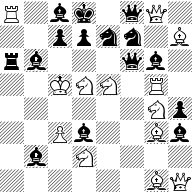 | 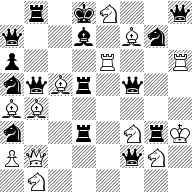 | 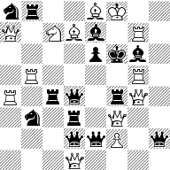 |
|  |  |  |  |
| 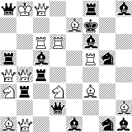 |  | 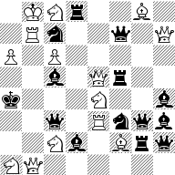 |  |
| 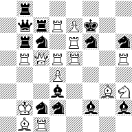 |  |  | 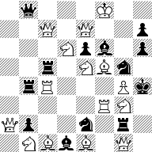 |
| 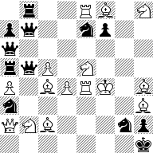 |  |  |  |
|  |  |  | 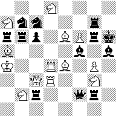 |
| 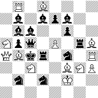 |  |  |  |
| 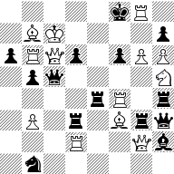 | 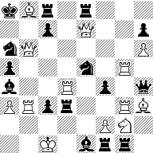 | 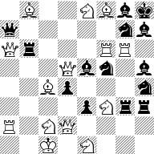 | 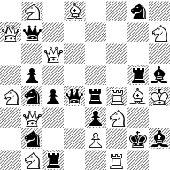 |
|  | 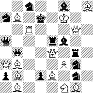 |  |  |
| 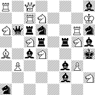 | 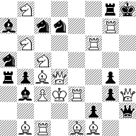 |  | 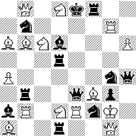 |
| 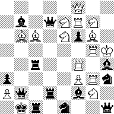 |  | 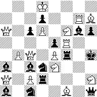 |  |
|  | 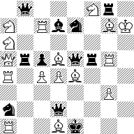 |  | 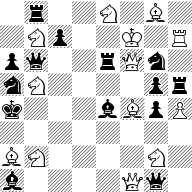 |

Not shown in the diagrams is that the first 22 have White to move, the remaining 30 have Black to move, and in the final position, the pawn at h4 can be captured en-passant. Castling rights need not be shown since none of the diagrams have a king and its rook in original position.

## These 52 positions have two things in common.

One, they're all legal. That is, reachable from the starting position in a valid game of chess.

Two, they're randomly generated.  
In fact, these 52 are all the legal positions among a sample generated by picking 1000 random integers in a specific range, and converting each integer into a corresponding position. Hovering the mouse over each position will show its rank, as we call it.

## Rankings.

A ranking is a triple consisting of a size, 
an unrank function that maps integers in the range 0..size-1 to objects,
and a rank function that maps objects to integers.

The number of integers n that map to a specific object need not be exactly one,
but if we extend each object with its multiplicity n and an index in the range 0..n-1, making the objects uniquely rankable, then we do obtain a 1-1 correspondence.

This Haskell based software suite implements a ranking of uniquely rankable chess positions (urpositions) of size N = 8726713169886222032347729969256422370854716254.
It uses Forsyth–Edwards Notation or FEN [0] for input and output, with the following modifications:
 * we consider a position to feature en-passant only when the pawn that just moved 2 spaces finds itself adjacent to an opponent pawn.
 * we use the last two fields for unique rankability

## Estimating the number of legal positions

The 52 legal positions have an average multiplicity of 56/52~1.077, slightly higher than the 1.052 average of all 1000.
With a 95% confidence level [1], this yields an **estimated number of legal positions of** (5.2% +- 1.96 sqrt(5.2% * 94.8% / 1000)) * N / 1.077, or **4.2e44 +- 1.1e44**.

The file sortedRnd1kResearchManual contains all 1000 positions together with their legality determination.

## Improving accuracy of the estimate

The estimate above has less than one digit of accuracy.
More accuracy can be obtained by analysing the larger samples
testRnd10kResearch, testRnd100kResearch, or testRnd1mResearch, with the last
one giving a full 2 digits of accuracy at the 95% confidence level.

While manual analysis of the 921 potentially legal positions in the 10k sample
(which includes the 1k sample) is quite doable, the even larger samples will
probably require additional software to aid and/or distribute the analysis
effort.

# Reproducibility

We produced our integer samples using Haskell's built-in random number
generator with a seed of 0, and sorted the result for use in batched ranking
(Makefile targets testRnd1kRanks, testRnd10kRanks, and testRnd100kRank).

We checked invertibility of the ranking by ranking the results (Makefile targets testRnd1kRanking, testRnd10kRanking, and testRnd100kRanking), and comparing with the origin integers used for unranking.

We unranked these to obtain random urpositions (Makefile targets testRnd1kFENs,
testRnd10kFENs, and testRnd100kFENs), and ran some legality tests that
found 90+% of the positions to be definitely illegal (Makefile targets
testRnd1kResearch, testRnd10kResearch, testRnd100kResearch).

# Related Work

Estimates of the number of legal chess positions date back to Claude Shannon's seminal 1950 paper [2].

The reason for satisfying ourselves with a mere estimate is that we have no
hope of ever determining the number exactly, like we did in the game of Go [3].
Whereas in Go, deciding whether a given position is legal is quite simple,
determining the legality of a given chess position is exceedingly hard. It is
the essence of so-called retrograde analysis problems [4] that concern the
possible past moves rather than the possible future moves that normal chess
problems concern themselves with.

The reader is invited to study some of the best retrograde problems ever
composed, together with their intricate solution, at this ``Masterworks''
collection [5]. Evidence of the algorithmic hardness of retrograde problems may
be found in this recent computational complexity paper [6] that proves
retrograde decision problems on arbitrarily large chess boards to be
PSPACE-hard.

In his 1994 PhD thesis [7], Victor Allis claims a calculated upper bound of
5E52 and assumed ``the true state-space complexity to be close to 1E50''. We
suspect a programming bug led to these numbers being many orders of magnitude
too large.

In 1996, Shirish Chinchalkar obtained an upper bound of 1.77894E46 [8].  A copy
of the program that Shirish Chinchalkar developed to compute his upperbound may
be found in Will Entriken github's repo [9], which also contains his software
for ranking chess diagrams.

# Bug Bounties

Since validity of these results hinges on the ranking including all legal positions, a bounty of $256 is hereby offered to the first person to file an issue with a legal but unrankable position. A bounty of $128 is offered for a rankable position for which unranking reports the wrong multiplicity. Finally, a $64 bonus is available for demonstrating that sortedRnd10kResearchManual contains a classification error.

# Interesting observations

The upper bound of N = 8726713169886222032347729969256422370854716254
is computed in under 10s by src/CountChess.hs (Makefile target count).

The original ranking implementation based on src/Data/Ranking.hs took on the order of 10s per position on top of the startup time of around 30 mins.
Adding the batched rankings of src/Data/Ranking/Batched.hs resulted in huge speedups where many millions of positions could be generated within an hour.

The entire urposition ranking is composed out of 14 separate ranking functions called

    sideToMoveRanking
    caseRanking
    wArmyStatRanking bArmyStatRanking
    guardRanking
    enPassantRanking epOppRanking sandwichRanking
    opposeRanking pawnRanking castleRanking wArmyRanking bArmyRanking pieceRanking

where functions on the same row compose like a cartesian product, i.e. independent of each other (but dependent on the choices made in rankings above). The efficiency of the entire ranking is mostly attributable to the large final row.

Treating placement of kings just like that of other pieces hugely simplifies the ranking,
but allows positions with adjacent kings. Avoiding adjacent kings only improves the upper bound by 10%, which is not worth the complications and resulting slowdowns,

The maximum multiplicity of 2 * 70 = 140 is achieved on positions where 4 pieces but no pawns were captured, and with an en-passant pawn landing between two opponent pawns. For example, unranking 4363356584943110212154534698526026458664867108 yields "r3kb1r/ppp1pp1p/3p4/5PpP/8/8/PPPPP1P1/RNBQKBNR w KQkq g6 99 140".

Most urpositions (72.5%) have 4 captures, which supports up to 12 promotions.
The next most common capture counts are 5 (20%), 3 (5.7%), 6 (1.9%) and 7 (0.1%).

The number of promotions is much more evenly distributed, with 4 through 12 promotions accounting for
0.3%, 1.1%, 3.4%, 8.3%, 15.2%, 21.5%, 22.7%, 17.1%, 8.3%, and 2% of random urpositions.

The 1 million sample classifies as

    $ src/legal < sortedRnd1mFENs | grep "^ " | sort | uniq -c | sort -rn
    492045  Illegal Both Kings in Check
    173401  Illegal Side not to move in Check
    102541  Illegal Adjacent Kings
    79019  Illegal Bishops Too Monochromatic
    53063  Single Check
    35584  No Checks
    29962  Illegal Triple Check
    27832  Illegal Double Check
    5839  Discovered Double Check
     714  Illegal Double Knight Check

leaving 53063 + 35584 + 5839 = 94486 positions for manual analysis.

# References

[0] https://en.wikipedia.org/wiki/Forsyth%E2%80%93Edwards_Notation

[1] https://en.wikipedia.org/wiki/Binomial_proportion_confidence_interval#Normal_approximation_interval

[2] https://vision.unipv.it/IA1/ProgrammingaComputerforPlayingChess.pdf

[3] https://tromp.github.io/go/legal.html

[4] https://en.wikipedia.org/wiki/Retrograde_analysis

[5] https://www.janko.at/Retros/Masterworks/Part1.htm

[6] https://arxiv.org/abs/2010.09271

[7] http://fragrieu.free.fr/SearchingForSolutions.pdf

[8] https://www.chessprogramming.org/ICGA_Journal#19_3

[9] https://github.com/fulldecent/chess-upper-bound-armies
